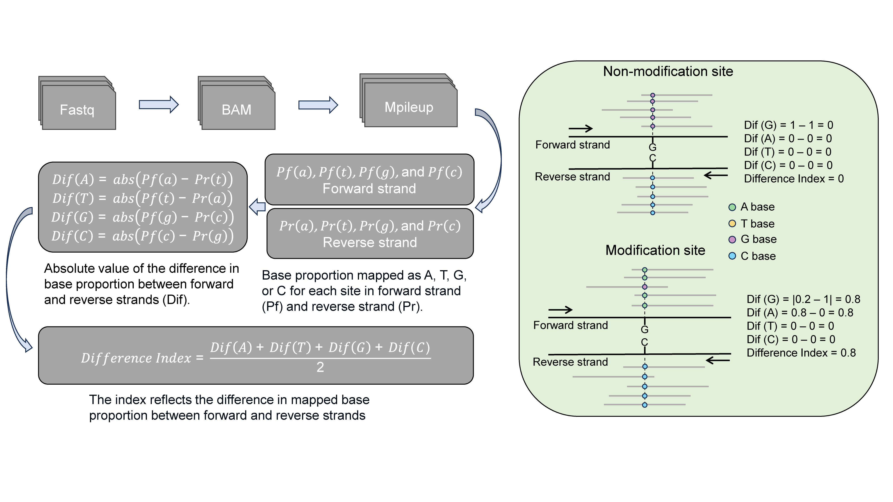
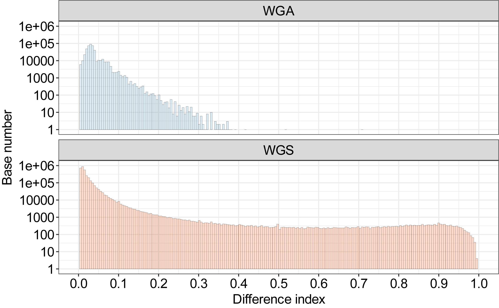
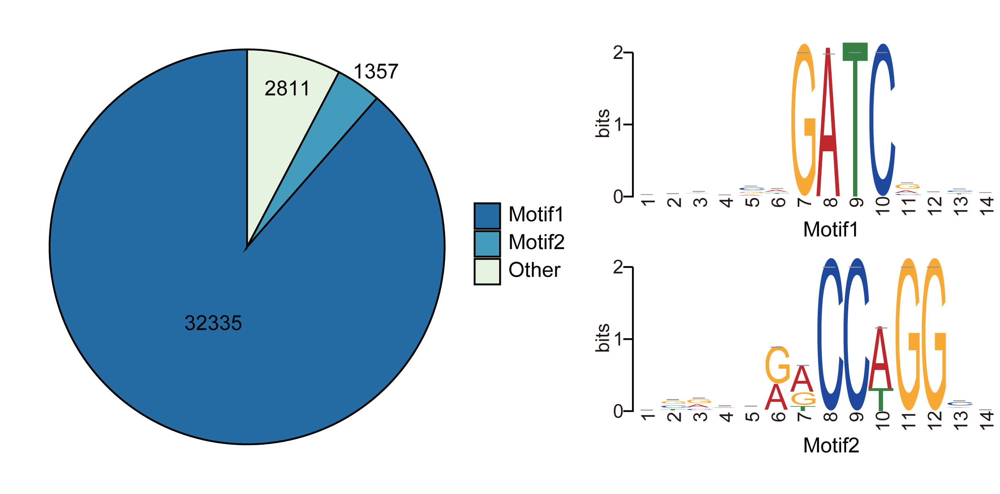
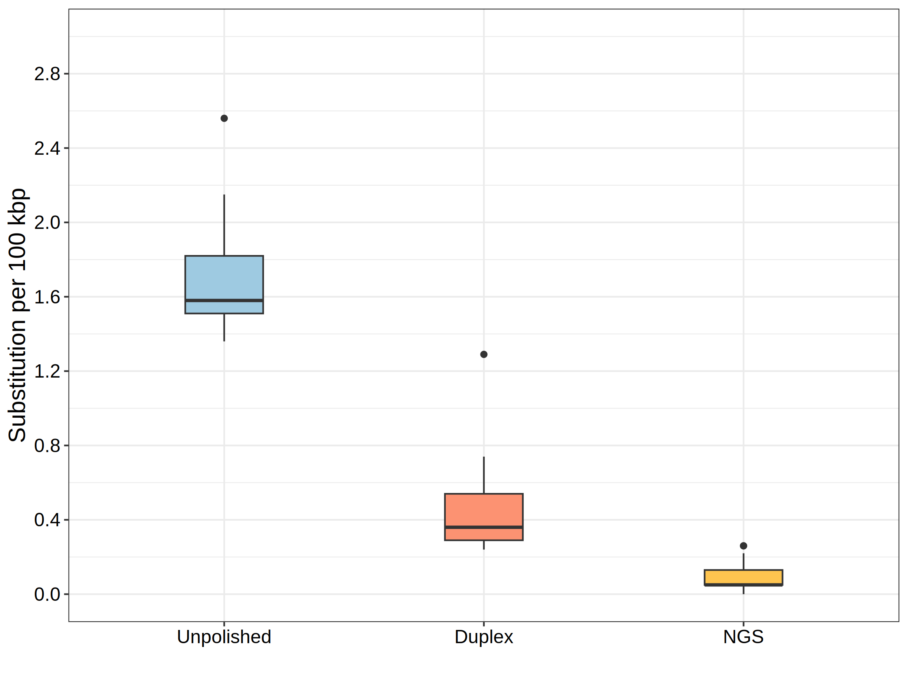

Overview
========

|image1|

``Hammerhead`` is a tool designed to *de novo* identify bacterial DNA
methylation, including 4mC, 5mC, and 6mA, based on the strand-specific
mismatch patterns observed in R10.4.1 nanopore sequencing reads. It does
not require negative controls (methylation-free datasets); only native
DNA reads and references are needed as input for Hammerhead.

Author’s notes
==============

We are continuously improving ``Hammerhead`` to enhance its usability
and expand its capabilities. Your feedback is greatly appreciated. You
can contact us via email at xudongliu98@gmail.com or
runsheng.li@cityu.edu.hk, or directly through the `GitHub issues
page <https://github.com/lrslab/Hammerhead/issues>`__.

Workflow
========

|image2|

``Hammerhead`` utilizes a self-defined metric called the difference
index (DI) to quantify the discrepancy in observed accuracy between the
forward and reverse strands at individual sites. This difference index
serves as a measure of the potential modification probability. A higher
value of the difference index indicates a higher likelihood of
modification at the corresponding site.

Installation
============

To use this tool, you’ll need to install additional tools or packages
for read processing, including samtools and minimap2. The following
command can help you install dependencies.

You can directly use `Conda <https://docs.conda.io/en/latest/>`__ to
download and install the dependencies based on the current environment.

.. code:: shell

   conda install -c bioconda -c conda-forge minimap2 samtools bedtools -y

Also, you can create a new environment to install these dependencies.

.. code:: shell

   conda create -n hammerhead -c bioconda -c conda-forge python samtools minimap2 bedtools -y 
   conda activate hammerhead

If you ncounter any version conflicts, you can select a specific version
of the software to resolve the issue.

.. code:: shell

   conda install -c bioconda -c conda-forge minimap2==2.17 samtools==1.17 bedtools==2.30.0 -y

Once you solve the problem of dependencies, the following command can
help to install the ``Hammerhead``.

.. code:: shell

   pip install Hammerhead-View

Quick usage
===========

``Hammerhead`` can be run in two different strategies to locate
methylation positions:

The first strategy is to select the sites with a difference index (DI)
over the cutoff, the default is 0.35.

.. code:: shell

   hammerhead --ref genome.fa --read input.fastq

The second strategy is to select the top N sites, based on the
difference index sorted from the largest to the smallest, the default
number is 2000.

.. code:: shell

   hammerhead --ref genome.fa --read input.fastq --method top

Example
=======

Here, we provide demo datasets (R10.4.1 simplex reads of *E. coli*) for
testing the ``Hammerhead``. The following commands can help to download
them.

.. code:: shell

   wget https://figshare.com/ndownloader/files/46437190 -O ecoli.fa
   wget https://figshare.com/ndownloader/files/46437193 -O test.fastq.gz

Please run the following command to start data analysis!

.. code:: shell

   hammerhead --ref ecoli.fa --read test.fastq.gz --min_depth 5 --min_depth_strand 3

**Note:** The arguments used in this command were for demonstration
purposes only (the read coverage of data was too shallow) and may not
reflect the optimal settings for your dataset. It is generally
recommended to use the default arguments when you have sufficient read
coverage, typically considered to be more than 50-fold coverage.

Detailed usage
==============

::

   usage: test [-h] --ref  --read  [--cpu] [--method] [--cut] [--num] [--min_depth] [--min_depth_strand]
   A tool helps to find the potential modification sites
   optional arguments:
     -h, --help           show this help message and exit
     --ref                Input reference (FASTA)
     --read               Input reads (FASTQ)
     --cpu                CPU number (default:10)
     --method             The strategy for detecting potential modification sites, cutoff or top (default:cutoff)
     --cut                Cutoff value [0, 1] (default:0.35)
     --num                Top N sites with the Difference index, sorted from the largest to the smallest (default:2000)
     --min_depth          The minimum depth (default:50)
     --min_depth_strand   The minimum depth for forward strand and reverse strand (default:25)

**ref:** the bacterial reference (FASTA format)

**read:** the R10.4.1 reads of the bacterial sample (FASTQ format), also
support for the compressed data (sample.fastq.gz).

**cpu:** the number of CPUs used during analysis, the default is 10.

**method:** the methods to detect the potential modifications (cutoff or
top), the default is the cutoff.

**cut:** the cutoff of DI, required by the cutoff in method, the default
is 0.35.

**num:** the number of top sites, required by the top in method, the
default is 2000.

**min_depth:** the minimum depth of the site used for downstream
analysis, the default is 50.

**min_depth_strand:** the minimum depth of the forward or reverse site
used for downstream analysis, the default is 25.

Strategy I: cutoff
------------------

When the cutoff is selected in the method argument, ``Hammerhead`` will
select the site with a DI over the cutoff (default: 0.35).

.. code:: shell

   hammerhead --ref genome.fa --read input.fastq

The default value of 0.35 was selected based on the DI distribution of
four methylation-free datasets to ensure a low false positive rate (FDR)
of less than 1e-6. For some bacterial species with a different K-mer
pattern with these four bacteria, we encourage the user to experiment
with different cutoffs.

.. code:: shell

   # examples
   hammerhead --ref genome.fa --read input.fastq --cut 0.1
   hammerhead --ref genome.fa --read input.fastq --cut 0.2
   hammerhead --ref genome.fa --read input.fastq --cut 0.3

Strategy II: top
----------------

To avoid the cutoff issues, the top can be used in the method argument.
``Hammerhead`` will select the top N sites based on the DI, sorted form
the largest to the smallest. The default number is 2000.

.. code:: shell

   hammerhead --ref genome.fa --read input.fastq --method top

The user is also encouraged to experiment with different numbers.

.. code:: shell

   hammerhead --ref genome.fa --read input.fastq --method top --num 1000
   hammerhead --ref genome.fa --read input.fastq --method top --num 3000

Results
=======

when you run the example provided by Hammerhead, you can get the
following outputs.

.. code:: shell

   ├── ecoli.fa
   ├── ecoli.fa.fai
   ├── enrichment.bed
   ├── enrichment.fa
   ├── mapping.mpileup.txt
   ├── mapping.sort.bam
   ├── potential_modification_site.bed
   ├── potential_modification_site.txt
   └── test.fastq.gz

Methylation files
-----------------

The **potential_modification_site.bed** and
**potential_modification_site.txt** are files that include the position
and detailed metrics of potential modification sites. If using the top
strategy, there will be an extra file named
**difference_index_table.txt**, including the DI information for the
total used sites. The following table is a demo of
**potential_modification_site.txt**.

.. code:: shell

   #Chr	Start	End	Difference_index	Dif_A	Dif_T	Dif_G	Dif_C	A,T,G,C,a,t,g,c 
   ecoli1_tig1	39570	39571	0.667	0.0	0.667	0.0	0.667	0,0,0,3,0,2,0,1 
   ecoli1_tig1	50133	50134	0.5	0.0	0.0	0.5	0.5	0,0,2,2,0,0,5,0

The **Chr**, **strat**, and **End** are the position information of
potential modification sites. The **Difference_index** means the
difference index, a metric indicates the probability of methylation. The
**Dif_A**, **Dir_T**, **Dir_G**, and **Dif_C** mean the strand
difference in A, T, G, and C bases, respectively. The
**A,T,G,C,a,t,g,c** means the number of reads mapped as the A/T/G/C in
the forward strand and T/A/C/G in the reverse strand.

Motif enrichment files
----------------------

The **enrichment.bed** and **enrichment.fa** files are position and
sequences of 21-mer reads. These reads are selected around the potential
modification sites used for the motif enrichment analysis (-10 bp, +10
bp). The **enrichment.fa** file can be used for
`Meme <https://meme-suite.org/meme/tools/meme>`__, a website tool for
motif enrichment, with a motif wide from 4 to 20 in advance options. Our
own motif enrichment tool specific to Hammerhead is developing.

Other temporary files
---------------------

The **mapping.mpileup.txt** and **mapping.sort.bam** files are temporary
files generated during the read processing. You can remove them by
following the command.

.. code:: shell

   rm -r mapping.mpileup.txt mapping.sort.bam

Tool showcase
-------------

To show the potential of Hammerhead to identify the modifications in the
bacterium. Here, two datasets from *E. coli* were used to call
methylation including whole-genome sequencing (WGS) and whole-genome
amplification (WGA) R10.4.1 simplex reads. The *dam* and *dcm* genes
were found in the genome of the used *E. coli* strain. These two genes
are associated with the G6mATC and C5mCWGG methylation.

|image3|

The distribution of difference index for sites in *E. coli* genome. The
WGA reads were used as a negative control due to the lack of inherent
methylation information. Based on the background noise of WGA reads, the
sites with a difference index over 0.35 were regarded as potential
modification sites.

|image4|

The motif of CCWGG and GATC was enriched using the sequences near these
potential modification sites (-10 bp to +10 bp).

**Note:** Two datasets are available at the
`here <https://figshare.com/articles/dataset/_i_E_coli_i_datasets/24298663>`__.
Both datasets were basecalled using the modification aware model, which
is available in the part of the **Retrained model**.

Supplementary
=============

Assemblies polish
-----------------

Consider the presence of error-prone sites within ONT-based assemblies.
Here we provided a pipeline to correct these sites by duplex polishing.

Step 1. Finding the potential modification sites
~~~~~~~~~~~~~~~~~~~~~~~~~~~~~~~~~~~~~~~~~~~~~~~~

.. code:: shell

   hammerhead --ref genome.fa --read sample.fq

After running the Hammerhead pipeline with your ``R10.4.1``\ reads, you
will receive a file named **potential_modification_site.bed**. This file
includes the positions of the potential modification sites that have
been identified in your assembly.

Step 2. Polishing sites using duplex reads
~~~~~~~~~~~~~~~~~~~~~~~~~~~~~~~~~~~~~~~~~~

.. code:: shell

   hammer_polish --read <duplex_reads> --bed <position_sites> --ref <assembly>

After executing this script, you will obtain a file named
``corrected_site.bed``. This file contains information about the sites
that require replacement.

.. code:: shell

   #the details of corrected_site.bed
   #chr	pos	base	N_A	N_T	N_G	N_C	P_A	P_T	P_G	P_C	polish_base
   contig_4	29153	T	0	1	0	13	0.0	0.07142857142857142	0.0	0.9285714285714286	C
   contig_6	155419	A	1	0	20	0	0.047619047619047616	0.0	0.9523809523809523	0.0	G
   contig_7	60990	A	4	0	24	0	0.14285714285714285	0.0	0.8571428571428571	0.0	G	*
   contig_7	118348	G	25	0	7	0	0.78125	0.0	0.21875	0.0	A
   contig_7	123180	C	0	19	0	2	0.0	0.9047619047619048	0.0	0.09523809523809523	T
   contig_7	344011	C	0	19	0	4	0.0	0.8260869565217391	0.0	0.17391304347826086	T

``chr``, ``pos``, ``base`` are the base type and position in the
reference of potential modification sites.

``N_A``, ``N_T``, ``N_G``, ``N_C`` are the number of reads which were
mapped as A, T, G, and C base at potential modification sites.

``P_A``, ``P_T``, ``P_G``, ``P_C`` are the proportion of reads which
were mapped as A, T, G, and C base at potential modification sites.

``polish_base`` is the base after polished.

**Note**: The sites that are identified in the results are selected
based on the proportion of errors. If you believe that any of the sites
are correct, please manually remove them. The presence of an \**asterisk
(\*)*\* indicates this is an ambiguous site that is challenging to
determine as an error.

Step 3. Replacing erroneous bases in the assembly with correct counterparts
~~~~~~~~~~~~~~~~~~~~~~~~~~~~~~~~~~~~~~~~~~~~~~~~~~~~~~~~~~~~~~~~~~~~~~~~~~~

.. code:: shell

   cat corrected_site.bed | grep -v pos | awk '{if ($12 == "C") print $0}' | awk '{print $1 "\t" $2-1 "\t" $2}' > C.bed
   cat corrected_site.bed | grep -v pos | awk '{if ($12 == "G") print $0}' | awk '{print $1 "\t" $2-1 "\t" $2}' > G.bed
   cat corrected_site.bed | grep -v pos | awk '{if ($12 == "T") print $0}' | awk '{print $1 "\t" $2-1 "\t" $2}' > T.bed
   cat corrected_site.bed | grep -v pos | awk '{if ($12 == "A") print $0}' | awk '{print $1 "\t" $2-1 "\t" $2}' > A.bed

   bedtools maskfasta -fi <assembly> -bed A.bed -mc A -fo tmp1.fasta
   bedtools maskfasta -fi tmp1.fasta -bed T.bed -mc T -fo tmp2.fasta
   bedtools maskfasta -fi tmp2.fasta -bed G.bed -mc G -fo tmp3.fasta
   bedtools maskfasta -fi tmp3.fasta -bed C.bed -mc C -fo final.fasta

   # remove the temporary files
   rm tmp1.fasta tmp2.fasta tmp3.fasta A.bed T.bed G.bed C.bed

The ``final.fasta`` is the final polished genome assembler.

.. _tool-showcase-1:

Tool showcase
~~~~~~~~~~~~~

To demonstrate the effectiveness of the polishing strategy based on the
Hammerhead in correcting substitution error types (``G2A`` and ``C2T``)
caused by DNA modifications in assemblies, we present the substitution
rates of 15 assemblies. These assemblies were generated using 40-， 50-,
and 60-fold random subsampling *Acinetobacter pittii* R10.4.1 reads. We
compared the results obtained from different polishing approaches with
the reference chromosome.

-  No polishing
-  Polishing potential modification sites with approximate 10-fold
   duplex reads
-  Polishing total assemblies with 50-fold next-generation sequencing
   (NGS) reads

|image5|

Retrained model
---------------

Here we provide two retained models for users to help ``Hammerhead`` get
a higher sensitivity to modification like C5mCWGG. The new basecalling
model was fine-tuned from the original DNA super accuracy model (SUP)
using `bonito <https://github.com/nanoporetech/bonito>`__ (V0.7.2) with
the following parameters “–epochs 40 –lr 5e-4 –batch 32 –pretrained
dna_r10.4.1_e8.2_400bps_sup@v4.2.0”.

The model retrained with *E. coli* methylation-free data is available
`here <https://figshare.com/articles/dataset/Modifaction_aware_model/24305242>`__.

The model retrained with four methylation-free data, including *A.
pittii*, *E. coli*, *E. faecium*, and *K. pneumoniae*, is available
`here <https://figshare.com/articles/dataset/Retrained_basecall_model/25858072>`__.

.. |image1| image:: ../figures/Logo.png

